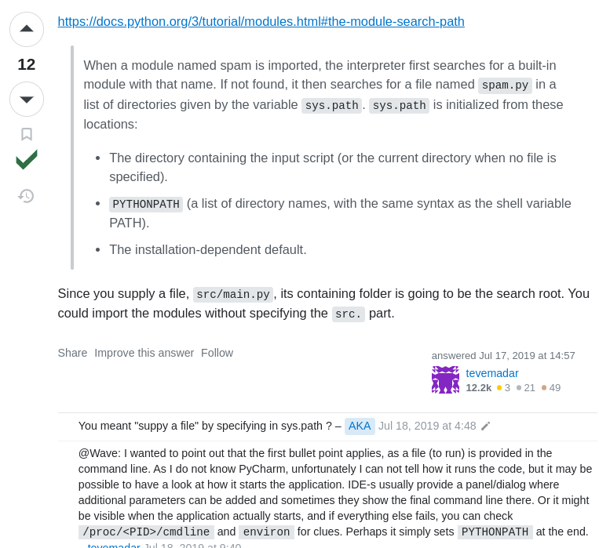

# Imports

## Fixing "ModuleNotFoundError: No module named '<src>'"

```py
project_dir/
  -- csv_data/
  -- src/
    -- pages/
      -- __init__.py
      -- page_1.py
      -- page_2.py
    -- __init__.py
    -- dashboard_home.py
    -- directories.py
  .gitignore
  README.md

# pages_1.py
from src.directories import csv_dir
```

`streamlit run dashboard_home.py`raise **ModuleNotFoundError: No module named 'src'**

**Fix [Module Not Found Error: No module named 'src'](https://stackoverflow.com/questions/57078689/module-not-found-error-no-module-named-src)**

```py
# pages_1.py
from directories import csv_dir
```


